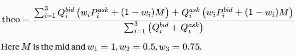

# Complex VWAP theo and stop-and-reverse backtest

Interactive charts of order book snapshots and trades, with our theo (complex VWAP), the mid, the strategy's fills, and its cumulative PnL underneath.

- `index.html` is dataset 1 (`vwap_workshop_books.csv`, `vwap_workshop_trades.csv`).
- `set2.html` is dataset 2 (`vwap_workshop_books_set2.csv`, `vwap_workshop_trades_set2.csv`).

Each page is a single HTML file with its data embedded. Open it in a browser, no install needed.

## Part 1: The theo

We chose our VWAP to mainly focus on the volumes across all levels. The intuition is: each side's size pulls theo toward the opposite price, with deeper levels blended toward mid, so a heavy bid pushes theo up and a heavy offer pushes it down.



For further improvements, and to add the trade info we had, we thought of skewing the theo by a parameter based on how much we lost against a specific counterparty's trades on a rolling basis (i.e. a markout).

## Part 2: Sizing

For the size we are just using a fixed 10 lots, but a more optimal way would be to make size a function of how far our theo is from the mid (increasing volume with the standard deviation of that distance).

## Part 3: Fees and margin

If there were transaction fees of £0.2 per fill, we would factor that in by subtracting it off the edge we calculate we should have. In deciding the trading strategy, we do:

```python
diff_vwap_ask = vwap_value - best_ask_price
diff_vwap_bid = -(vwap_value - best_bid_price)
```

These are our respective edges to buying and selling. In this case, we subtract the transaction fee to get:

```python
diff_vwap_ask = vwap_value - best_ask_price - trans_fee
diff_vwap_bid = -(vwap_value - best_bid_price) - trans_fee
```

This would then affect whether or not we trade, and our size calculation.

With a margin limit of £5000, we would have to reduce our total exposure. This can be done in the following ways:

- **Raising the threshold on `diff_vwap_ask` and `diff_vwap_bid` to reduce volume.** This reduces the number of uncertain trades and makes us less likely to hit our margin limit, while maintaining the size of our more certain trades.
- **Reducing the volume of every trade by a fixed scale so we never exceed the margin limit.** The advantage is that it maintains the ratio of our variance to our profit. However, it guarantees less profit.

## The strategy as currently implemented

**Signal.** At each snapshot, long if theo > mid, short if theo < mid. No action if they are equal.

**Trigger.** Always in the market with a target position of +/-10 lots. We trade only when the signal crosses: 20 lots on a flip, 10 on the first entry.

**Execution.** The decision is made at Tn and filled at Tn+1's top of book (lift the best ask to buy, hit the best bid to sell), so there is no lookahead. Size is capped at the quantity showing at the touch. Partial fills are accepted and not topped up until the next cross.

**PnL.** Cash + position x mid, with any final position exited at the mid.

## Results

| Dataset | Trades | Lots traded | Partial fills | Final PnL | Max drawdown |
|---|---|---|---|---|---|
| Set 1 (`index.html`) | 4 | 60 | 1 | 0.00 | -1.25 |
| Set 2 (`set2.html`) | 7 | 110 | 1 | +0.25 | -1.50 |

PnL is in price x lots.

## Caveats

- The trade files give only the interval between two snapshots, so market trades are spaced evenly inside their interval in sequence order. That spacing only affects where they sit on the chart.
- Only the touch is tradable in the simulation; deeper levels are not swept.
- No fees in the backtest. The edge-based rule with fees in Part 3 is a proposed extension; the implemented signal is theo vs mid.
- Pages load Plotly from a CDN, so they need an internet connection to render.

## Reproducing

```bash
pip install -r requirements.txt
python run_all.py   # regenerates index.html and set2.html from data/
```

Code is in `src/`: `vwap_backtest.py` (theo and backtest) and `plot_backtest.py` (charts).
